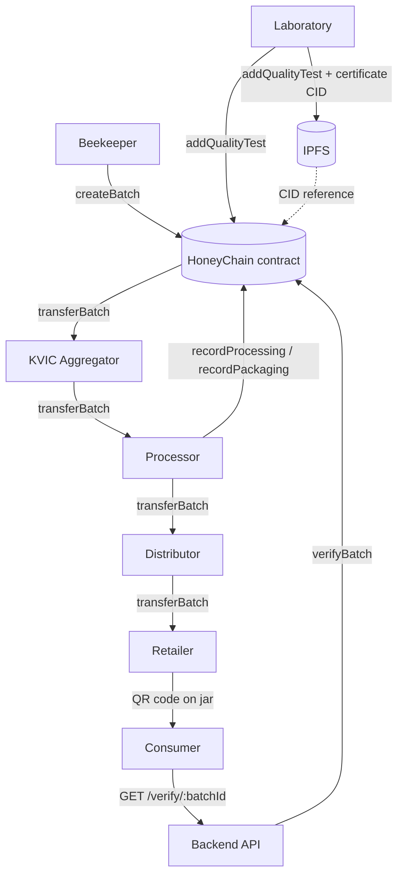

# HoneyChain — Architecture

## What HoneyChain does

HoneyChain lets a beekeeper register a honey harvest batch, a laboratory attach a
quality-test result, and each downstream supply-chain participant (aggregator,
processor, distributor, retailer) record custody and processing/packaging
events. A consumer scans a QR code printed on the jar, which resolves to
`/verify/{batchId}`, and sees the batch's full, tamper-evident history.

## Why blockchain is used here

The blockchain is used specifically for the properties a normal database
cannot cheaply provide:

- **Tamper-evidence** — once a `BatchCreated`, `QualityTestAdded`,
  `BatchTransferred`, `ProcessingRecorded` or `PackagingRecorded` event is
  mined, it cannot be silently edited or deleted the way a database row can.
- **A single, cross-organization source of truth for custody** — the
  beekeeper, lab, processor, distributor and retailer are independent
  parties who don't share a database; a shared ledger with role-gated writes
  lets them all trust the same custody record without trusting each other's
  backend.
- **Independent auditability** — anyone (including a regulator or a
  consumer's own tooling) can re-derive the batch timeline directly from
  on-chain events, without depending on HoneyChain's own backend staying
  honest.

## Why a normal database is *still* used

Blockchain writes are slow and expensive, and public chains are a poor fit
for high-volume, frequently-updated, or query-heavy data. The off-chain
database (not built in this blockchain-layer repo, but which this layer is
designed to sit behind) is expected to hold:

- application user accounts, auth, sessions
- dashboards and reporting views
- full IoT/sensor history (temperature, humidity, weight, acoustic readings)
- AI prediction outputs
- anything that needs full-text search, joins, or high write throughput
- UI-specific/display-only data

The rule of thumb used throughout this design: **if losing it would break an
audit or a trust claim, it goes on-chain (or its hash does); if it's just
operational or analytical data, it stays off-chain.**

## What is stored where

| Data | Location | Why |
|---|---|---|
| Batch identity, custody, status | On-chain (`HoneyChain.sol`) | Needs tamper-evidence & cross-party trust |
| Quality-test result + certificate CID | On-chain | Needs tamper-evidence; the PDF itself does not |
| Lab certificate PDF | IPFS | Content-addressed, large, doesn't belong in contract storage |
| Full sensor/IoT history | Off-chain DB | High volume, not itself trust-critical |
| IoT data hash/reference (optional) | On-chain | Lets you prove *later* that a specific reading existed at a point in time, without paying to store every reading |
| Dashboards, AI predictions, UI state | Off-chain DB | Query-heavy, not tamper-evidence-critical |
| Beekeeper phone/address/ID/email | Nowhere on-chain | Privacy — see below |

## IPFS vs. hashing — a distinction this project takes seriously

A **CID** (Content Identifier) is not the same thing as a SHA-256 hash of a
file's raw bytes:

- A CID is self-describing: it encodes a multibase prefix, a version, a
  content type, and the hash function used.
- For anything beyond a single small file (directories, large files chunked
  by the underlying DAG), the CID is the root of a Merkle DAG, not a direct
  hash of the concatenated bytes.
- Two different IPFS clients/versions can in principle produce different
  CIDs for logically identical content, depending on chunking parameters.

Because of this, HoneyChain stores **both**, in separate fields, and never
conflates them:

- `certificateCID` — the IPFS location, used to *retrieve* the document.
- `certificateHash` (optional) — a plain `keccak256`/`sha256` digest of the
  exact file bytes, used to *verify byte-for-byte integrity* against a
  freshly re-downloaded copy, independent of any IPFS-specific hashing
  behavior. See `src/ipfs/ipfsClient.ts` (`sha256Hex`) and
  `HoneyChain.verifyDocumentHash`.

## Privacy: what never goes on a public chain

Per the project's engineering rules, the following are **never** written
on-chain, in any field:

- beekeeper phone number, home address, government ID, or email
- precise GPS coordinates of a hive or home

Instead:

- Beekeepers are identified on-chain only by wallet **address**.
- Location is represented by an `originClusterId` — a rural cluster/region
  label (e.g. `"Rural-Cluster-A"`), not a home address or GPS pin.
- If a future version needs exact coordinates for internal logistics, the
  coordinates should live in the off-chain database, with only a hash/
  reference (not the raw coordinates) optionally anchored on-chain — the
  same CID/hash pattern used for documents.

## IoT trust model

Raw sensor readings (hive weight, temperature, humidity, acoustic data) are
**not** trustworthy just because a backend process writes them to a
blockchain — the chain only guarantees that *a value was recorded at a
timestamp*, not that the sensor wasn't tampered with or the reading wasn't
fabricated by the backend itself. HoneyChain's prototype trust model is:

```
IoT Gateway --> Backend --+--> Database: full sensor history
                          +--> Blockchain: hash/reference for important evidence only
```

This repository does **not** implement sensor-signing or oracle
attestation. If a future version claims "cryptographically authenticated
IoT data," it must implement an actual device-signing + on-chain signature
verification mechanism (e.g. each gateway holds a key and signs readings
before they're hashed on-chain). Until then, any such claim would be
false, and this project explicitly avoids making it — see `docs/security.md`.

## High-level flow


